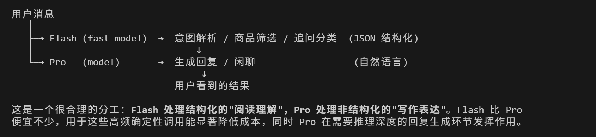

# SoulDance ShopGuide Agent 比赛技术说明

飞书文档链接：待填写（提交前替换为已开放权限链接）

## 1. 项目概述：理解与表达解耦的导购 Agent

SoulDance ShopGuide 是一个面向电商导购场景的多轮智能导购系统。项目面向真实购物对话中的几个高频挑战：用户表达模糊、条件会逐轮补充、会反选品牌或成分、会要求多商品对比，也会在推荐之后直接加入购物车。

典型输入包括：

```text
想要一个化妆的，送给妈妈
更贵一点
不要这个品牌
第一款和第三款怎么选
就这个来两件
```

系统采用“结构化理解”和“自然语言表达”分工的设计：

```text
用户输入
  |
  |-- Flash（fast_model）
  |      -> Intent / Slot / 分类
  |      -> 商品筛选意图 / 追问分类
  |      -> RetrievalPlan JSON 结构化
  |
  |-- Shopping Decision Engine
  |      -> Session 状态
  |      -> Cache
  |      -> 检索、排序、过滤
  |      -> 证据治理、候选选择、最终校验
  |
  |-- Pro（model）
         -> 推荐解释 / 闲聊 / 自然语言回复
         -> 用户看到的结果
```

Flash 负责高频、确定性、结构化的“阅读理解”；Pro 负责用户可读的“写作表达”。后端承接中间的导购决策链路，控制商品、价格、约束、购物车和事件输出。这样的分工让推荐过程具备可验证、可交互、可扩展的工程边界。

## 2. 系统架构

系统主链路使用 DeepSeek Flash / DeepSeek Pro。Embedding 使用本地 `bge-small-zh-v1.5`，适配当前小数据集并减少外部 API 往返。语音输入使用豆包 ASR API，语音输出在比赛演示配置中使用豆包 TTS API。

| 系统层级 | 核心职责 |
|---|---|
| Flash 理解层 | 解析 Intent、Slot、类目、追问类型，生成 RetrievalPlan JSON |
| Session 状态层 | 维护当前任务、多轮上下文、focus 商品、澄清和恢复状态 |
| Shopping Decision Engine | 检索、排序、过滤、证据治理、候选选择和最终校验 |
| Pro 表达层 | 基于最终结构化结果生成推荐解释、评论摘要和闲聊回复 |
| Event Layer | 输出商品卡、结构化对比、购物车、语音和快捷操作 |

核心链路：

```text
用户消息
  -> Flash：Intent / Slot / 分类 / RetrievalPlan JSON
  -> Session：current_task / focus_product / pending state
  -> Decision Engine：Cache / Retrieve / Rerank / Filter / Validate
  -> Pro：自然语言表达
  -> Event Layer：text_delta / product_item / comparison_result / cart_update / audio_delta
```

评委可以把系统理解为一个导购决策流水线：Flash 把用户话语转成可执行计划，后端执行商品决策，Pro 把决策结果说清楚，客户端只消费最终可渲染事件。

## 3. 一次导购请求如何执行

以用户输入为例：

```text
推荐一款手机，预算4000，拍照优先
```

执行流程：

```text
Flash
  -> intent = recommend_product
  -> sub_category = 智能手机
  -> price_max = 4000
  -> priority = 拍照

Session
  -> 更新当前购物任务
  -> 合并预算、类目、偏好和历史上下文

RetrievalPlan
  -> 生成可执行检索计划
  -> 包含类目、预算、品牌、排除项、搜索词

Memory Cache
  -> 尝试复用已验证过的结构化推荐决策

Retrieve + Rerank
  -> BM25 召回关键词相关商品
  -> 本地 BGE embedding 召回语义相关商品
  -> 对候选商品做初步排序

Hard Filter
  -> 校验预算、价格上下限、品牌、类目、成分

EvidenceBundle
  -> 商品描述 / FAQ / 评论切块
  -> 分成 support / risk / ignored

Candidate Selection
  -> 在候选池内选择 product_id

Backend Validation
  -> 复核 product_id、primary、数量上限和所有硬约束

Pro
  -> 生成主推结论、评论摘要、备选差异

Event Output
  -> text_delta
  -> product_item
  -> quick_actions
  -> done
```

这个流程把“理解、决策、表达、渲染”分开管理。商品卡只来自最终校验后的 `product_item` 事件，客户端看到的结果和后端 primary 商品保持一致。

## 4. Shopping Decision Engine

Shopping Decision Engine 是系统的核心执行层，负责把结构化需求变成可落地的商品决策。

### 4.1 Retrieval

检索层采用 hybrid scoring。实现上由 `EmbeddingRetriever` 统一完成检索打分：

```text
query
  -> jieba 分词
  -> BM25 关键词分
  -> 本地 BGE 向量相似度分
  -> 归一化后融合：0.65 * dense_score + 0.35 * bm25_score
  -> 返回 top_k 候选商品
```

两类信号的作用：

- 关键词搜索：BM25 负责精确词命中，适合品牌词、类目词和显式偏好，例如“华为”“拍照”“面霜”。
- 语义搜索：本地 BGE embedding 会把用户需求和商品内容转成向量，再比较语义相似度，适合口语化表达和近义需求，例如“清爽防晒”“油皮不闷”“送妈妈稳妥”。

本地 embedding 采用 `bge-small-zh-v1.5`。当前商品数据集规模较小，本地模型可以承担语义召回增强，减少 embedding API 往返带来的延迟。模型目录缺失或加载异常时，检索器会自动使用 BM25 分数完成召回。

### 4.2 EvidenceBundle

商品说明、FAQ 和评论会被拆成 evidence chunks。系统根据当前需求把内容分成三类：

```text
support  支持推荐的证据
risk     风险、负面反馈或约束冲突
ignored  与当前需求弱相关或跨类目噪声
```

例子：

```text
用户要拍照手机：
夜拍清晰 / 抓拍快 / 影像旗舰 -> support
机身偏重 / 发热明显 -> risk
好吃 / 入口香甜 -> ignored

用户要敏感肌面霜：
温和 / 修护屏障 -> support
刺痛 / 泛红 -> risk
物流快 / 包装好 -> 弱相关或 ignored
```

EvidenceBundle 的价值在于“运行时治理证据”。原始评论保留在商品数据中，当前轮导购根据用户需求判断哪些内容能支持推荐、哪些内容需要提示风险、哪些内容应该退出推荐摘要。

### 4.3 Candidate Selection

候选商品经过召回、排序、硬过滤和证据治理后，再进入候选选择阶段。选择层只输出已有候选池内的 `product_id` 和简短理由，例如：

```json
{
  "selected_product_ids": ["phone_001", "phone_002"],
  "reasons": {
    "phone_001": "匹配拍照优先，价格在预算内"
  }
}
```

这个输出还会经过后端校验，保证商品存在、价格和品牌满足约束、类目一致、数量合理。

### 4.4 Backend Validation

最终校验覆盖：

```text
product_id 存在性
类目 / 子类目一致性
预算、价格上限、价格下限
品牌包含 / 品牌排除
成分排除
候选范围
出卡数量
primary 一致性
```

`final_selected_products[0]` 是唯一主推。文本、商品卡、quick actions、session focus 都围绕这个 primary 生成，避免“文案主推”和“商品卡主推”错位。

## 5. Cache：缓存可验证导购决策

ShopGuide 的缓存围绕结构化决策设计，保存可复核的推荐结果和排序结果。

### 5.1 Recommendation Memory

Recommendation Memory 缓存最终推荐决策：

```text
normalized_query
taxonomy
hard_constraints
soft_preferences
selected_product_ids
roles
reasons
short_response_summary
catalog_fingerprint
```

完全相同或高度规范化一致的请求命中后，可以跳过 retriever、ranker 和 candidate selection。命中后仍会执行商品存在性、taxonomy、hard filter 和最终出卡校验。

### 5.2 Structured Rank Cache

Structured Rank Cache 缓存：

```text
RetrievalPlan -> RankedProduct
```

cache key 包含：

```text
intent
category / sub_category
price_min / price_max
include_brands / exclude_brands
exclude_terms
soft_preferences
retrieval_query
catalog_fingerprint
```

因此：

```text
推荐防晒霜，不要酒精
推荐防晒霜，酒精可以接受
```

会进入不同缓存分支。ShopGuide 的缓存策略可以概括为：快，但不乱快。

## 6. 多轮状态与事件协议

真实导购往往跨多轮进行。系统在 Session 中维护：

```text
current_task
constraint_state
focus_product_id
last_recommendations
context_events
pending_clarification
pending_recovery
cart_memory
```

这些状态支撑以下交互：

| 用户表达 | 系统行为 |
|---|---|
| 更贵一点 | 在上一轮类目内寻找价格更高的替代商品 |
| 更便宜一点 | 在上一轮类目内寻找价格更低的替代商品 |
| 不要这个品牌 | 解析当前 primary 品牌并加入排除约束 |
| 稳妥不踩雷 | 作为 pending clarification 的补充条件 |
| 第一款和第三款怎么选 | 引用最近可见推荐集生成结构化对比 |
| 就这个来两件 | 把当前 focus 商品加入购物车，数量为 2 |

系统输出采用事件协议：

```text
assistant_state          状态、intent、retrieval_mode、memory_mode
text_delta               流式文本
clarification_request    澄清问题
filter_recovery_options  无匹配恢复选项
products_start           商品卡开始
product_item             最终可见商品卡
products_done            商品卡结束
quick_actions            快捷追问按钮
comparison_result        结构化商品对比
cart_update              购物车更新
audio_delta              语音流
done                     本轮结束
```

客户端消费的是可渲染事件：文本、商品卡、对比表、购物车和语音流。RAG 中间候选、内部证据 chunk 和未校验结果只存在于后端流程中。

## 7. 用户交互示例

### 多轮导购体验示例



这张图展示了项目的核心交互思路：Flash 负责把用户话语转成结构化导购状态，Pro 负责把最终决策表达给用户。结合实际导购链路，系统可以完成以下体验：

### 多轮状态继承

用户可以先给预算，再补充偏好，再要求换款。系统会把预算、类目、品牌、focus 商品和历史推荐集合并到同一轮任务中，支持“更贵一点”“更便宜一点”“刚刚那个为什么推荐”等追问。

### 反选能力

用户表达“不要 OPPO”“不要小米”“不要这个品牌”时，系统会把品牌 alias 归一化后写入硬约束，并在最终出卡前重新过滤。

### 评论证据治理

推荐解释包含简短评论摘要，例如优点、风险和适配场景。无关评论进入 `ignored`，负面反馈进入 `risk`，推荐理由优先使用与当前需求相关的证据。

### Event 驱动交互

客户端收到的是结构化事件：商品卡、快捷操作、对比结果、购物车更新和语音流。用户看到的导购体验接近完整购物流程，而非单段文本回复。

## 8. 问题与解决方案

| 问题 | 解决方案 |
|---|---|
| `化妆的送妈妈` 推荐到食品礼盒 | Taxonomy alias 将 `化妆/化妆品/彩妆` 归入美妆护肤，并保留送礼、长辈偏好 |
| `不要华为` 仍返回 HUAWEI | 品牌 alias 统一为 canonical brand，写入 `exclude_brands` 后由 Hard Filter 执行 |
| `更贵一点` 跳到其他类目 | Follow-up 继承上一轮 `category/sub_category`，只改变相对价格方向 |
| 文本主推和商品卡 primary 不一致 | `final_selected_products[0]` 作为唯一 primary，Pro 只解释该商品 |
| 评论污染推荐理由 | EvidenceBundle 将证据分为 `support/risk/ignored`，推荐摘要使用相关证据 |
| cache 错误复用 | cache key 包含 taxonomy 和 hard constraints，命中后仍执行最终校验 |
| 对比找不到上一轮商品 | Session event memory 保存最近可见推荐集，引用解析基于可见商品 |
| 语音演示延迟 | 输入使用豆包 ASR API，输出使用豆包 TTS API，保证演示实时性 |

这一组问题来自真实调试过程，也体现了系统从“能回答”到“能稳定导购”的关键工程收敛。

## 9. 多模态语音能力

语音作为输入输出模态接入同一条导购链路：

```text
用户语音
  -> 豆包 ASR API
  -> 文本
  -> Flash
  -> Shopping Decision Engine
  -> Pro
  -> 豆包 TTS API
  -> 语音播报
```

输入语音使用豆包 ASR API。输出语音在比赛演示配置中使用豆包 TTS API，当前配置为：

```text
TTS_PROVIDER=doubao_chunked_v3
DOUBAO_TTS_URL=https://openspeech.bytedance.com/api/v3/tts/unidirectional
DOUBAO_TTS_MODEL=seed-tts-2.0-standard
```

后端 `TTSAdapter` 同时保留 `openai_audio`、`mimo` 和 `doubao_chunked_v3` 多 provider 适配，便于本地服务联调和不同环境切换。比赛演示口径采用豆包 TTS。

本地开源语音模型在部署后响应较慢，比赛演示更重视低延迟、稳定性和实时交互，所以语音输入输出选择成熟 API 服务。

## 10. 技术栈

| 类别 | 技术 |
|---|---|
| 后端 | Python 3.12、FastAPI、WebSocket、Pydantic v2、Uvicorn、HTTPX |
| 主链路 LLM | DeepSeek Flash、DeepSeek Pro、OpenAI-compatible Chat Completions、JSON structured output |
| 检索 | BM25、本地 `bge-small-zh-v1.5`、Sentence Transformers、jieba、rank-bm25 |
| 排序与证据 | Hard Filter、EvidenceBundle、Candidate Selection、Backend Validation |
| 语音 | 豆包 ASR API、豆包 TTS API、STTAdapter、TTSAdapter |
| 存储 | 内存 Session、内存 Cache、可选 JSON 持久化 |
| 测试 | Pytest、WebSocket/API 行为测试、Agent 核心场景测试 |

## 11. 项目亮点

### 11.1 理解与表达解耦的双模型链路

ShopGuide 使用 DeepSeek Flash 处理高频结构化理解，用 DeepSeek Pro 处理最终自然语言表达。Flash 输出 Intent、Slot、分类和 RetrievalPlan JSON，后端完成检索、约束、证据治理和校验，Pro 基于最终结果生成用户可读回复。相比单模型全包方案，这种链路在成本、延迟和结构化稳定性上更适合导购场景。

### 11.2 EvidenceBundle 动态证据治理

系统会把每个商品的评论、FAQ 和商品描述切成短证据片段，再结合当前用户需求重新判断这些片段的用途：

- `support`：能支持当前推荐的内容，例如用户要拍照手机时，“夜拍清晰”“抓拍快”会进入支持证据。
- `risk`：可能影响购买决策的负面反馈，例如“机身偏重”“敏感肌刺痛”“续航一般”会进入风险提示。
- `ignored`：和当前商品或当前需求关系弱的内容，例如手机商品里混入“好吃、入口香甜”这类食品评论，会退出推荐摘要。

最终商品卡默认只展示结论型理由和简短评论摘要；用户追问“为什么推荐”“评论怎么说”时，系统再基于 EvidenceBundle 展开解释。这样既能利用真实评论增强可信度，也能降低无关评论对推荐结果的干扰。

### 11.3 可验证导购决策缓存

系统缓存结构化导购决策和排序结果，包括 `selected_product_ids`、taxonomy、constraints、roles、reasons 和 summary。命中后继续执行商品存在性、taxonomy、hard filter 和最终校验，在提速的同时保持预算、品牌、类目和成分约束有效。

## 附录 A：依赖环境与配置说明

后端环境：

```text
env/venv_shopguide_backend
```

本地 embedding 模型：

```text
model/bge-small-zh-v1.5
```

语音模型兼容环境：

```text
env/venv_vllm_cu128
env/conda_gcc12
```

主链路 LLM 配置：

```bash
LLM_PROVIDER=deepseek
LLM_MODEL=deepseek-pro
LLM_FAST_MODEL=deepseek-flash
LLM_API_KEY=运行时密钥
LLM_BASE_URL=DeepSeek OpenAI-compatible endpoint
```

Embedding 配置：

```bash
USE_EMBEDDING=1
EMBEDDING_MODEL_DIR=model/bge-small-zh-v1.5
EMBEDDING_DEVICE=cuda:0
```

Session、购物车和缓存：

```bash
SHOPGUIDE_SESSION_DIR=data/sessions
SHOPGUIDE_CART_PATH=data/carts.json
SHOPGUIDE_MEMORY_CACHE_PATH=cache/shopguide_memory.jsonl
```

豆包语音配置：

```bash
STT_ENABLED=true
STT_PROVIDER=doubao_ws
DOUBAO_ASR_WS_URL=wss://openspeech.bytedance.com/api/v3/sauc/bigmodel_async

TTS_ENABLED=true
TTS_PROVIDER=doubao_chunked_v3
DOUBAO_TTS_URL=https://openspeech.bytedance.com/api/v3/tts/unidirectional
DOUBAO_TTS_RESOURCE_ID=seed-tts-2.0
DOUBAO_TTS_MODEL=seed-tts-2.0-standard
```

API key 通过运行时环境变量注入，源码、文档、缓存和日志均不承载密钥内容。

## 附录 B：目录结构

```text
backend/app/
  main.py                 FastAPI 入口，REST/WebSocket API
  agent.py                ShopGuide Agent 编排主链路
  intent_compiler.py      Flash 结构化语义理解入口
  semantic_layer.py       语义 IR、fallback、安全 guard
  query_builder.py        RetrievalPlan 构建
  state_reducer.py        Session 状态更新
  taxonomy.py             类目解析与 alias 映射
  knowledge_base.py       EvidenceBundle 与证据处理
  memory_cache.py         推荐缓存与检索缓存
  constraint_filter.py    预算、品牌、成分硬过滤
  reference_resolver.py   多轮引用解析
  cart.py                 购物车状态机
  stt_adapter.py          STT 接口适配
  tts_adapter.py          TTS 接口适配
  prompts/                semantic / selection / response prompt

tests/
  test_agent_core.py      Agent 核心行为测试
  test_api.py             REST/WebSocket 测试
  test_stt_adapter.py     STT 适配测试
  test_tts_adapter.py     TTS 适配测试

docs/
  interaction_protocol.md
  semantic_layer.md
  compiler_style_agent_architecture.md
  rag_memory_reranker_impl.md
  stt_deployment.md
```

## 附录 C：接口与事件

核心接口：

```text
WebSocket /ws/chat
REST 商品接口
REST 购物车接口
REST 调试接口
STT 上传 / 语音识别接口
反馈接口
```

核心事件：

```text
assistant_state
text_delta
clarification_request
filter_recovery_options
products_start
product_item
products_done
quick_actions
comparison_result
cart_update
audio_delta
audio_done
done
```

## 附录 D：测试验证

核心测试命令：

```bash
env/venv_shopguide_backend/bin/python -m pytest tests/test_agent_core.py tests/test_api.py -q
```

覆盖范围：

```text
语义解析
候选选择
预算上下限
品牌排除
成分排除
多轮追问
任务切换
澄清继承
无匹配恢复
结构化对比
自然语言购物车
cache 命中与约束隔离
EvidenceBundle 抗无关评论
商品卡事件顺序
STT / TTS adapter
```
